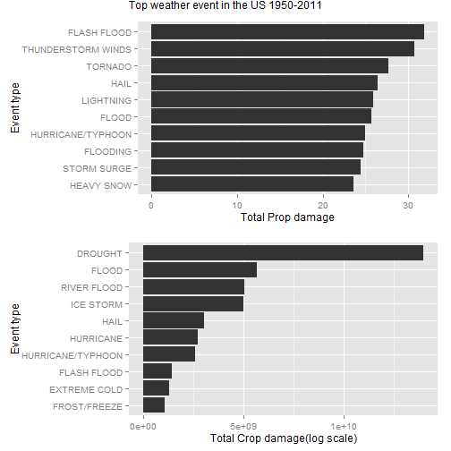

Impact of Severe Weather on Population Health and Economic
==========================================================
##Synopsis: 
The analysis of the dataset reveals that Tornado has the most severest impact on population health, which cased more than Ninty thousand fatalities and injuries in total from 1950 to 2011. Drought cased largest  crop damage and flash flood cased largest property damage.

##Data processing:
Loading dataset:

```r
dir <- 'D:/Coursera/5. Reproducible Research/Assessments'
setwd(dir)
data <- read.csv(bzfile('repdata-data-StormData.csv.bz2'))
```

##Impact on Population Health:
Compute the sum of fatalities and injuries corresponding to different event types:

```r
fatalities <- aggregate(data$FATALITIES, list(data$EVTYPE), FUN= sum)
names(fatalities) <- c('Evtype', 'Fatalities')
fata_order <- fatalities[order(-fatalities$Fatalities), ]

injuries <- aggregate(data$INJURIES, list(data$EVTYPE), FUN= sum)
names(injuries) <- c('Evtype', 'Injuries')
inju_order <- injuries[order(-injuries$Injuries), ]
```


##Impact on Economic:
Write a function to convert the records of exponentials into numeric value:

```r
exp_transform <- function(e){
    #B: billion; K: thousand; h and H: hundred; m and M: million
    if(e %in% c('B', 'b'))
        return(9)
    else if(e %in% c('m', 'M'))
        return(6)
    else if(e %in% c('K', 'k'))
        return(3)
    else if(e %in% c('h', 'H'))
        return(2)
    else if(e %in% c(1,2,3,4,5,6,7,8,9,0))
        return(e)
    else{
        return(0)}
}
```

Compute the value of property damage and crop damage:

```r
data$Propdmg_new <- sapply(data$PROPDMGEXP, exp_transform)
data$Cropdmg_new <- sapply(data$CROPDMGEXP, exp_transform)
data$Prop_value <- data$PROPDMG*(10**data$Propdmg_new)
data$Crop_value <- data$CROPDMG*(10**data$Cropdmg_new)
```

Compute the sum of property damage and crop damage corresponding to different event types:

```r
propdmg <- aggregate(data$Prop_value, list(data$EVTYPE), FUN=sum)
cropdmg <- aggregate(data$Crop_value, list(data$EVTYPE), FUN=sum)
names(propdmg) <- c('Evtype', 'Propdmg')
names(cropdmg) <- c('Evtype', 'Cropdmg')
propdmg_order <- propdmg[order(-propdmg$Propdmg), ]
cropdmg_order <- cropdmg[order(-cropdmg$Cropdmg), ]
propdmg_order$Propdmg <- log(propdmg_order$Propdmg)
```

##Result:
1.The impact of 10 most severest weather on population health:

```r
library(ggplot2)
library(gridExtra)
```

```
## Warning: package 'gridExtra' was built under R version 3.2.1
```

```
## Loading required package: grid
```

```r
p1 <- ggplot(data=head(fata_order, 10), aes(x=reorder(Evtype, Fatalities), y=Fatalities), fill=Fatalities) + 
    geom_bar(stat='identity') + 
    coord_flip() + ylab('Total fatalities') + xlab('Event type')

p2 <- ggplot(data=head(inju_order, 10), aes(x=reorder(Evtype, Injuries), y=Injuries)) + 
    geom_bar(stat='identity') +
    coord_flip() + ylab('Total injuries') + xlab('Event type')
grid.arrange(p1, p2, main='Top weather event in the US 1950-2011')
```

 

2.The impact of 10 most severest weather on property damage and crop damage:

```r
p3 <- ggplot(data=head(propdmg_order, 10), aes(x=reorder(Evtype, Propdmg), y=Propdmg)) +
    geom_bar(stat='identity') +
    coord_flip() + ylab('Total Prop damage') + xlab('Event type')

p4 <- ggplot(data=head(cropdmg_order, 10), aes(x=reorder(Evtype, Cropdmg), y=Cropdmg)) +
    geom_bar(stat='identity') +
    coord_flip() + ylab('Total Crop damage(log scale)') + xlab('Event type')
grid.arrange(p3, p4, main='Top weather event in the US 1950-2011')
```

 
