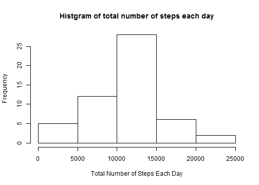
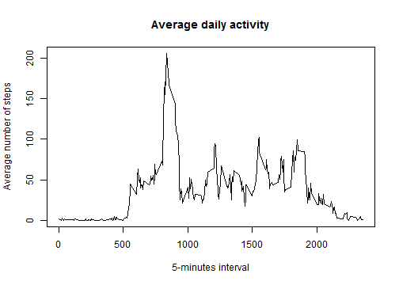
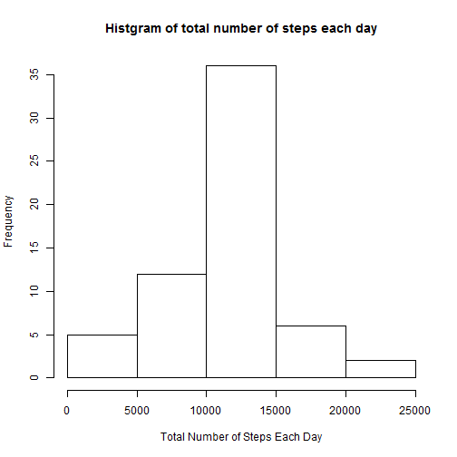
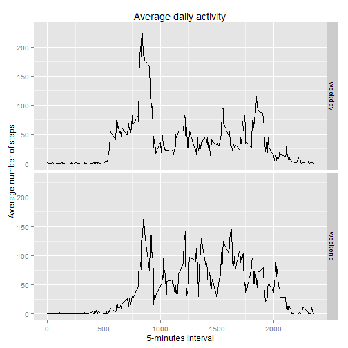

PeerAssesment1
==============
##1.Loading and preprocessing the data.

```r
dir <- 'D:/Coursera/5. Reproducible Research/Assessments'
setwd(dir)
data <- read.csv('activity.csv', header=TRUE, na.strings='NA')
#Date <- as.Date(data$date)
```

##2.The mean total number of steps taken per day.

```r
totalNumber <- aggregate(x=list(steps=data$steps), by=list(date=data$date), FUN=sum)
hist(totalNumber$steps, main='Histgram of total number of steps each day', xlab='Total Number of Steps Each Day')
```

 

```r
mean(totalNumber$steps, na.rm=TRUE); median(totalNumber$steps, na.rm=TRUE)
```

```
## [1] 10766.19
```

```
## [1] 10765
```

##3. The average daily activity pattern.

```r
mean.minutes <- aggregate(x=list(steps=data$steps), by=list(interval=data$interval), FUN=mean, na.rm=TRUE)
plot(mean.minutes$interval, mean.minutes$steps, type='l', main='Average daily activity', xlab='5-minutes interval', ylab='Average number of steps')
```

 

```r
mean.minutes[which.max(mean.minutes$steps),]
```

```
##     interval    steps
## 104      835 206.1698
```

##4. Imputing missing values.
The total number of missing values in the dataset:

```r
sum(is.na(data))
```

```
## [1] 2304
```
Replace NA with the mean for the same 5-minute interval:

```r
for(i in 1:length(data$steps)){
    if(is.na(data$steps[i]))
    data$steps[i]=mean.minutes$steps[which(mean.minutes$interval==data$interval[i])]}
```
Histogram of the total number of steps taken each day after replacing NAs:

```r
totalNumber2 <- aggregate(x=list(steps=data$steps), by=list(date=data$date), FUN=sum)
hist(totalNumber2$steps, main='Histgram of total number of steps each day', xlab='Total Number of Steps Each Day')
```

 

```r
mean(totalNumber2$steps, na.rm=TRUE); median(totalNumber2$steps, na.rm=TRUE)
```

```
## [1] 10766.19
```

```
## [1] 10766.19
```

##5. Are there differences in activity patterns between weekdays and weekends?

```r
data$date <- as.Date(strptime(data$date, "%Y-%m-%d"))
# convert date to weekday and weekend
weekdays.weekend <- function(date){
    day <- weekdays(date)
    if(day %in% c('Saturday', 'Sunday'))
        return('weekend')
    else
        return('weekday')
}
data$weekdays <- sapply(data$date, FUN=weekdays.weekend)
mean.minutes <-aggregate(steps ~ interval + weekdays, data=data, mean)

library(ggplot2)
#qplot(interval, steps, data=mean.minutes, facets= weekdays~., geom='line')+xlab('5-minutes interval') + ylab('Average number of steps')
g <- ggplot(mean.minutes, aes(x=interval, y=steps))
g + geom_line() + facet_grid(weekdays~.) + xlab('5-minutes interval') + ylab('Average number of steps') + labs(title='Average daily activity')
```

 

Process Rmd file to md and Html:

```r
#library(knitr)
#knit2html("PA1_template.Rmd")
```
